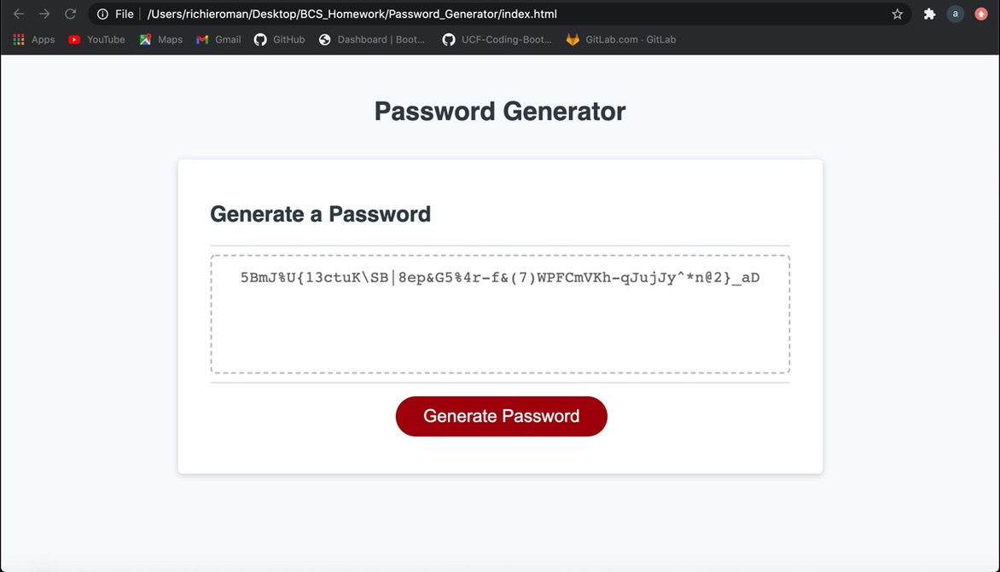

# Password_Generator

Homework 3 Password Generator

For this weeks Homework, I created a password generator that prompts the user to enter criteria for a random password.
It includes a minimum of 8 and a max of 128.
Also, you can choose between uppercase letter, lowerecase letters, numbers, and special characters.
It can be a mix of all four or you can choose just to use one of the criteria. The choice is yours!!!

<https://github.com/rroman6292/Password_Generator>

<https://rroman6292.github.io/Password_Generator/>
